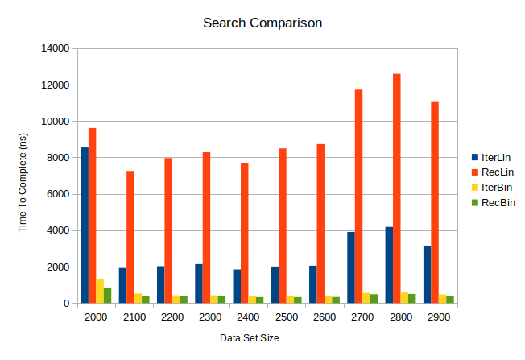

# CS 3308 Mission 05 -- Algorithm Analysis and Binary Search

## Due: Sunday February 17, 2019 @ 2300

## Purpose
* Gain experience implementing algorithms
* Gain experience working with recursion
* Gain experience comparing algorithm results
* Gain experience in algorithm analysis

## Part 1 - Algorithm Analysis
(2 Points each) Using the definition of big-oh notation, prove or disprove the following assertions (i.e., you must provide the c > 0 and n<sub>0</sub> >= 1 that fulfills the definition, or give a formal argument for why the assertion is false).

1. 2n<sup>3</sup> - 7n<sup>2</sup> + 100n - 36$ is in $O(n<sup>3</sup>)
2. 10n + 3log(n) is in O(n)
3. n/1000 is in O(1)
4. log(n)<sup>2</sup> + log(n)/30 is in O(log(n)<sup>2</sup>)
5. n<sup>2</sup>/log(n) + 3n is in O(n<sup>2</sup>)

(2 Points each) For each function below, provide the "tightest" big-oh bound. You can do this from the definition of big-oh if you are unsure of the answer, or you can use shortcuts and just provide the big-oh value.

6. 36n
7. n<sup>2</sup>/2 + 15n
8. (n<sup>2</sup>/4)(8/n)
9. n + 10log(n)
10. 87262

(4 Points each) For each method below, provide the tightest big-oh running time.
```java
public int m1FindLargest(int[] array) {
    if (array.length != 0) {
        int value = array[0];
        for (int i = 1; i < array.length; i++) {
            if (array[i] > value) {
                value = array[i];
            }
        }
        return value;
    }
    return -1;
}
```

```java
public void m2PrintTriangle(int size) {
    for (int i = 1; i <= size; i++) {
        for (int j = 1; j <= 1; j++) {
            System.out.print("*");
        }
        System.out.println();
    }
}
```

```java
public void m3PrintBooks(String books[], int[] stars) {
    if (books.length == stars.length) {
        for (int i = 0; i < books.length; i++) {
            System.out.print(books[i] + "'s stars: ");
            for (int j = 0; j < stars[i]; j++) {
                System.out.print("*");
            }
            System.out.println();
        }
    }
}
```

## Part 2 - Binary Search
You are going to build a small scale simulator to determine the relative cost of using binary search vs. linear search. The metric we will use to determine superiority is time (how long it takes to find a value). Basically, you are going to build a simulator that determines the average time to find a value in arrays of different sizes.

Your simulator will vary the size of the array (any range and increment you want, but go up to at least 2000 or so) using a generated random ordered array. You will then search for a random value between 0 and the largest in the array, timing how long that takes, using each of the following search methods:

* Iterative Binary Search
* Recursive Binary Search
* Iterative Linear Search
* Recursive Linear Search

Do this a large number of times (~2000) for each array size and average (and print) the search times.

Figure out the average time it takes to search for a value in an array of size (x, y, z) using binary search and linear search. Once your code is up and running, do your simulation. You should use the provided reporting method to generate both on screen and file based report of your results. Take those values you found and plot them (use whatever you want, MS Excel or Libre Office Calc may be easiest). Take the data and plot, and put them in a document. Write up a description reporting your results and and interpretation of their meaning. That is, compare the results of the simulation and the differences between the algorithms. What conclusions can you make? Finally save this document as a pdf.

For the implementations of the algorithms you may utilize the following pseudocode representations to get you started. Note that the classes must be implemented in the package: `edu.isu.cs.cs3308.algorithms.impl` and must implement the interface `edu.isu.cs.cs3308.algorithms.ArraySearch`. This is an implementation of the [Strategy Pattern](https://sourcemaking.com/design_patterns/strategy).

### Algorithm 1: IterativeLinearSearch(A, t)
```
for i = 0 to n - 1 do
   if A[i] = t then
       return i
   end if
end for
return -1
```

### Algorithm 2: RecursiveLinearSearch(A, t)
```
function LinearSearch(A, t)
    return recLinearSearch(A, t, 0)
end function

function recLinearSearch(A, t, index)
   if index >= n then
       return -1
   else if A[index] = t then
       return index
   end if
   return recLinearSearch(A, t, index + 1)
end function
```

### Algorithm 3: IterativeBinarySearch(A, t)
```
low = 0
high = n - 1
while low <= high do
   index = (low + high) / 2
   if t = A[index] then return index
   else if t < A[index] then
       high = index - 1
   else
       low = index + 1
   end if
end while
return -1
```

### Algorithm 4: RecursiveBinarySearch(A, t)
```
function BinarySearch(A, t)
   return recBinarySearch(A, t, 0, n-1)
end function

function recBinarySearch(A, t, low, high)
    index = (low + high) / 2
    if low >= high then
        return -1
    end if
    if t = A[index] then
        return index
    end if
    if t < A[index] then
        return recBinarySearch(A, t, low, index - 1)
    else
        return recBinarySearch(A, t, index + 1, high)
    end if
end function
```

## Assignment
1. Fork this repository
2. Complete Part 1 in a document
3. Complete Part 2 coding
4. Complete Part 2 in same document as Part 1
5. Final writeup should be in MLA format with your name and proper header. Failure to follow this format and include your name will result in a 0 in a zero for Part 1 and the writeup section of Part 2. See the [Purdue Owl MLA Guideline](https://owl.purdue.edu/owl/research_and_citation/mla_style/mla_formatting_and_style_guide/mla_formatting_and_style_guide.html) for information on proper MLA formatting.
5. Follow the submission procedures.

## Submission
### Answers to Part 1 Algorithm Analysis and Part 2 Algorithm Comparison
1. Combine your answers to questions in Part 1 with the comparison conducted in Part 2. Convert this combined document to PDF and submit to the Mission 05 dropbox on Moodle.

### Implementations of Algorithms in Part 1
When you have completed the assignment (all tests pass) or it is reaching midnight of the due date, make sure you have completed the following:

0. Your code compiles with no compilation errors
1. Committed all changes to your repo
2. Pushed your changes to GitHub
3. Tagged your repo as "COMPLETE"
4. Pushed the "COMPLETE" tag to GitHub

## Grading -- 50 Points
* __Part 1__: There are 32 points available, but only 25 points will count.
* __Part 2__:
    * 5 Points per implementation of each algorithm
    * 5 Points for the writeup of the simulation results.

## Hints
1. In order to measure time you may want to use `System.nanoTime()` before and after the call to a search method. Finding the difference will provide you with the most accurate representation of the time it took (in nanoseconds).
2. Be sure to review the tests and the interface `ArraySearch`.
3. Be sure to review the information concerning the [Strategy Design Pattern](https://sourcemaking.com/design_patterns/strategy) so you understand how it works.

## Example Results:
**Example Output (To `System.out`)**
```
N     IterLin  RecLin  IterBin  RecBin
2000  8550     9620    1328     855
2100  1927     7258    526      375
2200  2025     7965    423      368
2300  2140     8286    425      401
2400  1846     7696    383      327
2500  2006     8497    391      326
2600  2051     8735    393      332
2700  3907     11726   558      485
2800  4185     12597   588      504
2900  3155     11045   471      402
```

**Example Data (To a File)**
```
N,IterLin,RecLin,IterBin,RecBin
2000,8550,9620,1328,855
2100,1927,7258,526,375
2200,2025,7965,423,368
2300,2140,8286,425,401
2400,1846,7696,383,327
2500,2006,8497,391,326
2600,2051,8735,393,332
2700,3907,11726,558,485
2800,4185,12597,588,504
2900,3155,11045,471,402
```

**Example Chart**

